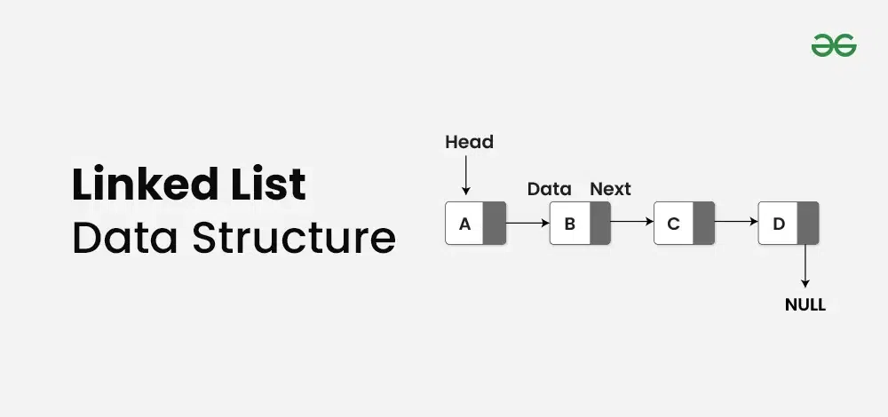

# Linked List

A linked list is a linear data structure where elements are stored in nodes.

Each node contains two parts:

1. **Data**: The value stored in the node.
2. **Reference** (or Pointer): A reference to the next node in the sequence.

### Types of Linked Lists

-   **Singly Linked List**: Each node points to the next node.
-   **Doubly Linked List**: Each node points to both the next and the previous node.
-   **Circular Linked List**: The last node points back to the first node, forming a circle.

### Operations on Linked Lists

1. **Traversal**: Visiting each node in the list.

    - **Time Complexity**: $O(n)$
    - **Space Complexity**: $O(1)$

2. **Insertion**:

    - **At the Beginning**: Insert a new node at the start of the list.
        - **Time Complexity**: $O(1)$
        - **Space Complexity**: $O(1)$
    - **At the End**: Insert a new node at the end of the list.
        - **Time Complexity**: $O(n)$ for a singly linked list, $O(1)$ for a doubly linked list if a tail pointer is maintained.
        - **Space Complexity**: $O(1)$
    - **At a Given Position**: Insert a new node at a specified position.
        - **Time Complexity**: $O(n)$
        - **Space Complexity**: $O(1)$

3. **Deletion**:

    - **From the Beginning**: Remove the first node of the list.
        - **Time Complexity**: $O(1)$
        - **Space Complexity**: $O(1)$
    - **From the End**: Remove the last node of the list.
        - **Time Complexity**: $O(n)$ for a singly linked list, $O(1)$ for a doubly linked list if a tail pointer is maintained.
        - **Space Complexity**: $O(1)$
    - **From a Given Position**: Remove a node from a specified position.
        - **Time Complexity**: $O(n)$
        - **Space Complexity**: $O(1)$

4. **Searching**:

    - **Description**: Find a node with a given value.
        - **Time Complexity**: $O(n)$
        - **Space Complexity**: $O(1)$

5. **Updating**:
    - **Description**: Update the value of a node at a given position.
        - **Time Complexity**: $O(n)$
        - **Space Complexity**: $O(1)$

### Space Complexity of a Linked List

-   **Singly Linked List**: Each node requires $O(1)$ space for the data and $O(1)$ space for the pointer. For $n$ nodes, the total space complexity is $O(n)$.
-   **Doubly Linked List**: Each node requires $O(1)$ space for the data and $O(2)$ space for the pointers (one for the next node and one for the previous node). For $n$ nodes, the total space complexity is $O(n)$.

### Advantages of Linked Lists

-   **Dynamic Size**: They can easily grow and shrink in size by allocating and deallocating memory as needed.
-   **Ease of Insertion/Deletion**: Inserting or deleting elements is easier compared to arrays, especially at the beginning or middle of the list.

### Disadvantages of Linked Lists

-   **Memory Usage**: Extra memory is required for the pointers in each node.
-   **No Random Access**: Accessing elements is sequential, which means it takes longer compared to arrays where elements can be accessed directly using an index.
-   **Complexity**: Implementing linked lists and their operations can be more complex compared to arrays.
