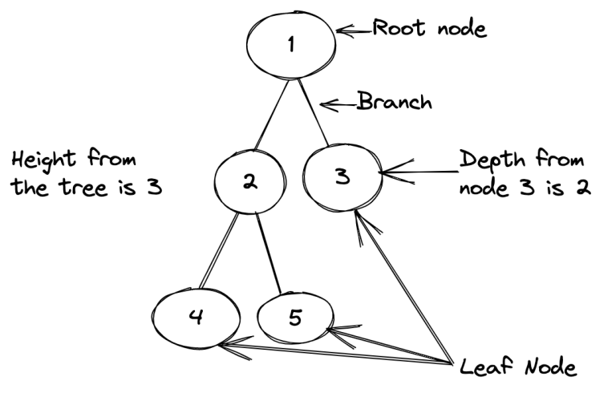
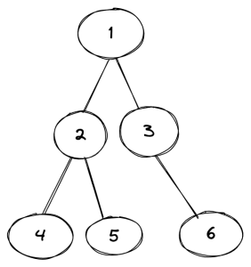
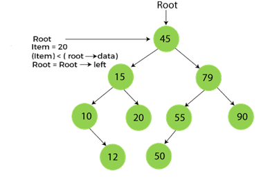

# Trees

## Table of Contents
1. [Introduction and Nomenclature](#introduction-and-nomenclature)
    - [Traversal](#traversal)
      - [Depth-First Traversal (DFT)](#depth-first-traversal-dft)
      - [Breadth-First Traversal (BFT)](#breadth-first-traversal-bft)
2. [Types of Trees](#types-of-trees)
    - [Binary Trees](#binary-trees)
    - [Binary Search Trees](#binary-search-tree)
    - [Balanced Trees](#balanced-trees)
    - [AVL Trees](#avl-trees)
    - [Red-Black Trees](#red-black-trees)
3. [Operations on Trees](#operations-on-trees)
    - [Insertion](#1-insertion)
    - [Deletion](#2-deletion)
    - [Search](#3-search)
    - [Traversal](#4-traversal)
    - [Minimum/Maximum](#5-minimummaximum)
    - [Height Calculation](#6-height-calculation)
    - [Checking Balanced](#7-checking-balanced)
4. [Special Operations for Balanced Trees](#special-operations-for-balanced-trees)
    - [Rotations (AVL, Red-Black Tree)](#8-rotations-avl-red-black-tree)
5. [Usage](#usage)
6. [Validation of Trees](#validation-of-trees)

## Introduction and Nomenclature
The tree data structure is a type of graph. A tree has a **root node** (top node) that will have a relationship with its child nodes. The path that connects the root node to the child nodes is called a **branch**. The **leaf node** is the node that doesn’t have any children and is not the root node.

**Height** in trees is the number of nodes from the highest branch to the root node. The **depth** of a tree is the count of nodes from a specific node to the root node.

### Traversal
#### Depth-First Traversal (DFT)

- **Preorder Traversal**: Visit root, then left subtree, then right subtree.
  - Sequence: Root -> Left -> Right.
  - Example: For tree A -> B, C -> D, E, traversal: A, B, D, E, C.

- **Inorder Traversal**: Visit left subtree, root, then right subtree.
  - Sequence: Left -> Root -> Right.
  - Example: For tree A -> B, C -> D, E, traversal: D, B, E, A, C.

- **Postorder Traversal**: Visit left subtree, right subtree, then root.
  - Sequence: Left -> Right -> Root.
  - Example: For tree A -> B, C -> D, E, traversal: D, E, B, C, A.

#### Breadth-First Traversal (BFT)

- **Level-Order Traversal**: Visit nodes level by level.
  - Example: For tree A -> B, C -> D, E, traversal: A, B, C, D, E.

## Types of Trees
### Binary Trees
A **binary tree** is a tree that has up to 2 child nodes:

### Binary Search Trees
A **binary search tree** is a binary tree with one additional property: *given a parent node with his two children, the value of the child on the left is always less then the value of the father and the value of the child on the right is always greater then the value of the father*.

### Balanced Trees
A **balanced tree** is a tree that follows the 3 conditions:
1. The height of the left and right tree for any node does not differ by more than 1.
2. The left subtree of that node is also balanced.
3. The right subtree of that node is also balanced.

### AVL Trees
In an **AVL tree**, the heights of the two child subtrees of any node differ by at most one; if at any time they differ by more than one, rebalancing is done to restore this property.

### Red-Black Trees
A Red-Black Tree is a type of self-balancing binary search tree with the following properties:

1. Each node is either red or black.
2. The root is black.
3. All leaves (NIL nodes) are black.
4. If a red node has children then, the children are always black.
5. Every path from a node to its descendant NIL nodes has the same number of black nodes.

The colors impose specific constraints that help guide the rebalancing process. These constraints are:
- Each node is either red or black.
- The root is always black.
- Red nodes cannot have red children (no two consecutive red nodes).
- Every path from a given node to any of its descendant leaves has the same number of black nodes (black-height).

## Operations on Trees
### 1. Insertion
- **Description**: Adding a new node to the tree.
- **Time Complexity**:
  - **Binary Search Tree (BST)**: $O(log(n))$ on average, $O(n)$ in the worst case.
  - **Balanced Trees (AVL, Red-Black Tree)**: $O(log(n))$.
- **Space Complexity**: $O(1)$ for iterative, $O(log(n))$ for recursive (due to call stack).

### 2. Deletion
- **Description**: Removing a node from the tree.
- **Time Complexity**:
  - **BST**: $O(log(n))$ on average, $O(n)$ in the worst case.
  - **Balanced Trees**: $O(log(n))$.
- **Space Complexity**: $O(1)$ for iterative, $O(log(n))$ for recursive.

### 3. Search
- **Description**: Finding a node with a given value.
- **Time Complexity**:
  - **BST**: $O(log(n))$ on average, $O(n)$ in the worst case.
  - **Balanced Trees**: $O(log(n))$.
- **Space Complexity**: $O(1)$ for iterative, $O(log(n))$ for recursive.

### 4. Traversal
#### Preorder, Inorder, Postorder (DFS)
- **Time Complexity**: $O(n)$
- **Space Complexity**:
  - **$O(h)$** where h is the height of the tree, for the call stack in recursive implementations. $O(n)$ in the worst case.
  
#### Level-order (BFS)
- **Time Complexity**: $O(n)$
- **Space Complexity**: $O(n)$ for storing nodes in a queue.

### 5. Minimum/Maximum
- **Description**: Finding the node with the minimum/maximum value.
- **Time Complexity**:
  - **BST**: $O(log(n))$ on average, $O(n)$ in the worst case.
  - **Balanced Trees**: $O(log(n))$.
- **Space Complexity**: $O(1)$ for iterative, $O(log(n))$ for recursive.

### 6. Height Calculation
- **Description**: Determining the height of the tree.
- **Time Complexity**: $O(n)$
- **Space Complexity**: $O(h)$ where h is the height of the tree, for the call stack in recursive implementations.

### 7. Checking Balanced
- **Description**: Determining if the tree is balanced.
- **Time Complexity**: $O(n)$
- **Space Complexity**: $O(h)$ where h is the height of the tree, for the call stack in recursive implementations.

## Special Operations for Balanced Trees

### 8. Rotations (AVL, Red-Black Tree)
- **Description**: Left or right rotations to maintain tree balance.
- **Time Complexity**: $O(1)$
- **Space Complexity**: $O(1)$

## Usage
- **DBMS**: Trees are used to implement indexing in databases which makes data retrieval operations efficient. B-trees and B+ trees are commonly used in database management systems.
- **File Systems**: Trees are used to represent the hierarchical structure of directories and files in file systems. This allows for efficient navigation and organization of files.
- **Syntax Trees**: Trees are used to represent the structure of source code in compilers and interpreters. Abstract Syntax Trees (ASTs) help in understanding and analyzing the syntax of the programming language.
- **Priority Queues**: Trees, specifically binary heaps, are used to implement priority queues. This allows for efficient insertion and deletion of elements based on priority.

## Validation of Binary Search Trees
A Binary Search Tree can be validated by using an Inorder traversal. If the result of this traversal is an ordered array, then the tree is valid.