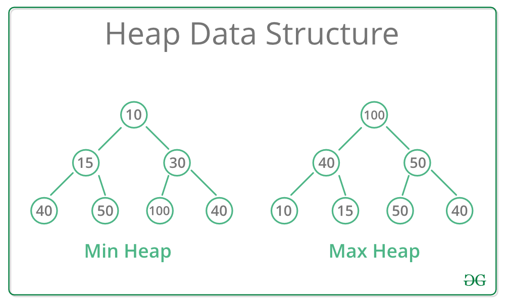

# Heap and Trie

## Table of Contents

1. [Heap](#heap)
    - [Operations on a Heap](#operations-on-a-heap)
    - [Complexity of Operations](#complexity-of-operations)
    - [Implementation Details](#implementation-details)
    - [Example Operations on a Max-Heap](#example-operations-on-a-max-heap)
2. [Trie](#trie)

## Heap

A heap is a specialized tree-based data structure that satisfies the heap property. This property can be one of two types:

1.  **Max-Heap**: In a max-heap, for any given node `i`, the value of `i` is greater than or equal to the values of its children.
2.  **Min-Heap**: In a min-heap, for any given node `i`, the value of `i` is less than or equal to the values of its children.

### Operations on a Heap

1.  **Insertion**: Adding a new element to the heap.
2.  **Extract-Max/Extract-Min**: Removing the root element (maximum in a max-heap or minimum in a min-heap).
3.  **Peek/Find-Max/Find-Min**: Retrieving the root element without removing it.
4.  **Heapify**: Ensuring the heap property is maintained, typically after insertion or deletion.
5.  **Build-Heap**: Creating a heap from an unsorted array.

### Complexity of Operations

1.  **Insertion**

    -   **Process**:
        1.  Add the element to the end of the heap.
        2.  "Bubble up" (also called "sift up" or "heapify up") the element to restore the heap property.
    -   **Time Complexity**: $O(log n)$ due to the height of the heap (binary heap).

2.  **Extract-Max/Extract-Min**

    -   **Process**:
        1.  Swap the root with the last element.
        2.  Remove the last element (previous root).
        3.  "Bubble down" (also called "sift down" or "heapify down") the new root element to restore the heap property.
    -   **Time Complexity**: $O(log n)$ due to the height of the heap.

3.  **Peek/Find-Max/Find-Min**

    -   **Process**: Directly return the root element of the heap.
    -   **Time Complexity**: $O(1)$ as the root is always accessible.

4.  **Heapify**

    -   **Process**: Adjust the heap to maintain the heap property starting from a given node and moving downwards.
    -   **Time Complexity**: $O(log n)$ for a single node, $O(n)$ for the entire heap when building from an array.

5.  **Build-Heap**

    -   **Process**: Convert an unsorted array into a heap.
    -   **Time Complexity**: $O(n)$. This is often surprising but results from the fact that heapifying subtrees of increasing sizes takes progressively less work overall.

### Implementation Details

-   **Binary Heap**: A common and simple type of heap implemented using an array. For a node at index `i`:
    -   The left child is at index `2i + 1`.
    -   The right child is at index `2i + 2`.
    -   The parent is at index `(i - 1) // 2`.

### Example Operations on a Max-Heap

1.  **Insertion Example**

    -   Heap: [10, 5, 3]
    -   Insert 7:
        1.  Add 7 to the end: [10, 5, 3, 7]
        2.  Bubble up 7: Compare with parent 5 → Swap: [10, 7, 3, 5]

2.  **Extract-Max Example**

    -   Heap: [10, 7, 3, 5]
    -   Extract-Max:
        1.  Swap 10 with last element 5: [5, 7, 3, 10]
        2.  Remove 10: [5, 7, 3]
        3.  Bubble down 5: Compare with children (7 and 3) → Swap with 7: [7, 5, 3]

By maintaining the heap property, heaps are efficient for priority queue operations, providing quick access to the maximum or minimum element.

## Trie
